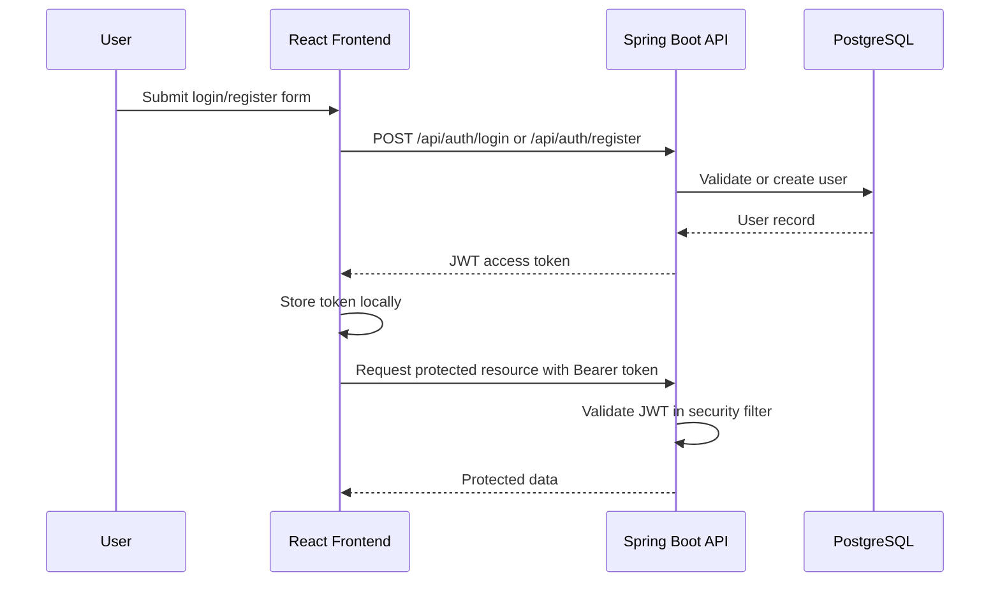

# CareerOS - AI-Powered Placement Preparation Platform

<p align="center">
  <strong>A full-stack career operating system for placement preparation, task planning, progress tracking, and interview readiness.</strong>
</p>

<p align="center">
  
  
  
  
  
  
  
  
  
  
</p>

---

## Table of Contents

- [Project Overview](#project-overview)
- [Problem Statement](#problem-statement)
- [Solution](#solution)
- [Key Features](#key-features)
- [Tech Stack](#tech-stack)
- [System Architecture](#system-architecture)
- [Project Folder Structure](#project-folder-structure)
- [Screenshots](#screenshots)
- [Installation Guide](#installation-guide)
- [Prerequisites](#prerequisites)
- [Environment Variables](#environment-variables)
- [Backend Setup](#backend-setup)
- [Frontend Setup](#frontend-setup)
- [Database Configuration](#database-configuration)
- [Running the Project Locally](#running-the-project-locally)
- [API Endpoints](#api-endpoints)
- [Sample API Requests](#sample-api-requests)
- [Authentication Flow](#authentication-flow)
- [Project Workflow](#project-workflow)
- [Database Schema Overview](#database-schema-overview)
- [Performance Optimizations](#performance-optimizations)
- [Security Features](#security-features)
- [Future Enhancements](#future-enhancements)
- [Deployment Guide](#deployment-guide)
- [Troubleshooting](#troubleshooting)
- [Contributing Guidelines](#contributing-guidelines)
- [License](#license)
- [Author Information](#author-information)
- [Contact Details](#contact-details)
- [Acknowledgements](#acknowledgements)

---

## Project Overview

**CareerOS** is an AI-ready placement preparation platform designed to help students organize their career journey from daily study plans to interview preparation. It brings together roadmaps, tasks, notes, placement applications, resumes, progress analytics, and productivity insights in one responsive full-stack application.

The project is built as a recruiter-friendly portfolio application using a modern React frontend, a secure Spring Boot REST API, JWT-based authentication, and a relational database layer backed by PostgreSQL.

## Problem Statement

Students preparing for campus placements often manage preparation across scattered tools: spreadsheets for applications, notes apps for revision, separate trackers for DSA and CS fundamentals, and manual reminders for tasks. This fragmented workflow makes it difficult to maintain consistency, identify weak areas, and measure actual progress.

## Solution

CareerOS centralizes the placement workflow into one structured platform. It gives students a personalized dashboard, preparation plans, daily tasks, roadmaps, knowledge notes, placement tracking, resume management, check-ins, rewards, and analytics so they can prepare with clarity and accountability.

## Key Features

- 🔐 **JWT Authentication** with Spring Security.
- 📊 **Dashboard** for preparation summary, statistics, activity, and recommendations.
- ✅ **Task Management** with completion, missed-task tracking, rescheduling, and timelines.
- 🧭 **Study Roadmaps** for structured learning paths and module progress.
- 📝 **Notes Management** with categories and revision scheduling.
- 🎯 **Placement Application Tracker** for company-wise application status.
- 📄 **Resume Management** for active and archived resume documents.
- 🧠 **Analytics Dashboard** covering study time, productivity, plans, tasks, heatmaps, and check-ins.
- ⏱️ **Focus Sessions** to record concentrated study work.
- 📅 **Daily Check-ins** to build preparation consistency.
- 🏆 **Gamification** with reward profile and achievement-ready data models.
- 📱 **Responsive UI** built with React, Tailwind CSS, and reusable components.
- 📘 **OpenAPI/Swagger Support** for backend API exploration.

## Tech Stack

| Layer | Technologies |
| --- | --- |
| **Frontend** | React.js, Vite, Tailwind CSS, React Router, TanStack Query, Axios, Recharts, Framer Motion, Lucide React |
| **Backend** | Spring Boot, Spring Web, Spring Security, Spring Data JPA, Spring Validation, Spring Actuator |
| **Language** | Java 21, JavaScript |
| **Database** | PostgreSQL primary; MySQL-compatible relational design with configuration changes |
| **Authentication** | Spring Security, JWT, JJWT |
| **APIs** | REST APIs, OpenAPI/Swagger |
| **Build Tools** | Maven, npm, Vite |
| **DevOps & Tools** | Docker, Docker Compose, Git, GitHub, Nginx |

## System Architecture

```mermaid
flowchart LR
    User["Student / Recruiter"] --> Browser["React + Tailwind Frontend"]
    Browser --> Router["Protected Routes + Auth Context"]
    Router --> API["Axios API Client"]
    API --> Backend["Spring Boot REST API"]
    Backend --> Security["Spring Security + JWT Filter"]
    Security --> Services["Service Layer"]
    Services --> Repositories["Spring Data JPA Repositories"]
    Repositories --> DB[("PostgreSQL Database")]
    Backend --> Swagger["OpenAPI / Swagger UI"]

    subgraph Frontend
      Browser
      Router
      API
    end

    subgraph Backend
      Backend
      Security
      Services
      Repositories
      Swagger
    end
```

## Project Folder Structure

```text
PlacementAI/
├── backend/
│   ├── src/main/java/com/careeros/
│   │   ├── analytics/
│   │   ├── auth/
│   │   ├── checkin/
│   │   ├── common/
│   │   ├── company/
│   │   ├── dashboard/
│   │   ├── focus/
│   │   ├── gamification/
│   │   ├── notes/
│   │   ├── notification/
│   │   ├── placement/
│   │   ├── plan/
│   │   ├── resume/
│   │   ├── roadmap/
│   │   ├── security/
│   │   └── CareerOsApplication.java
│   ├── src/main/resources/
│   │   └── application.properties
│   ├── Dockerfile
│   ├── pom.xml
│   └── .env.example
├── frontend/
│   ├── src/
│   │   ├── api/
│   │   ├── components/
│   │   ├── contexts/
│   │   ├── hooks/
│   │   ├── layouts/
│   │   ├── pages/
│   │   ├── routes/
│   │   ├── styles/
│   │   └── main.jsx
│   ├── Dockerfile
│   ├── nginx.conf
│   ├── package.json
│   └── .env.example
├── docs/
├── docker-compose.yml
├── .env.example
└── README.md
```

## Screenshots

> Replace these placeholders with real screenshots or demo GIFs when available.

| Screen | Preview |
| --- | --- |
| Landing Page | `docs/screenshots/landing-page.png` |
| Dashboard | `docs/screenshots/dashboard.png` |
| Task Manager | `docs/screenshots/tasks.png` |
| Roadmaps | `docs/screenshots/roadmaps.png` |
| Analytics | `docs/screenshots/analytics.png` |
| Demo GIF | `docs/demo/careeros-demo.gif` |

```md


```

## Installation Guide

You can run CareerOS in two ways:

1. **Manual local setup** for frontend and backend development.
2. **Docker Compose setup** for a production-like local environment.

## Prerequisites

| Tool | Recommended Version | Purpose |
| --- | --- | --- |
| Java | 21+ | Backend runtime |
| Maven | 3.9+ | Backend dependency management |
| Node.js | 20+ | Frontend runtime |
| npm | 10+ | Frontend package management |
| PostgreSQL | 16+ | Database |
| Docker | Latest stable | Containerized deployment |
| Git | Latest stable | Version control |

## Environment Variables

Create a root `.env` file from the provided example:

```bash
cp .env.example .env
```

Example:

```env
POSTGRES_DB=careeros
POSTGRES_USER=careeros
POSTGRES_PASSWORD=replace-with-a-strong-database-password
JWT_SECRET=replace-with-at-least-32-random-characters
JWT_EXPIRATION_MS=900000
CORS_ALLOWED_ORIGINS=http://localhost:3000
BACKEND_PORT=8080
FRONTEND_PORT=3000
JPA_DDL_AUTO=update
APP_LOG_LEVEL=INFO
```

Backend-specific `.env` example:

```env
DATABASE_URL=jdbc:postgresql://localhost:5432/careeros
DATABASE_USERNAME=postgres
DATABASE_PASSWORD=replace-with-your-local-password
JWT_SECRET=replace-with-at-least-32-random-characters
JWT_EXPIRATION_MS=900000
CORS_ALLOWED_ORIGINS=http://localhost:5173
JPA_DDL_AUTO=update
APP_LOG_LEVEL=INFO
PORT=8080
```

Frontend-specific `.env` example:

```env
VITE_API_BASE_URL=/api
```

## Backend Setup

```bash
cd backend
mvn clean install
mvn spring-boot:run
```

The backend runs on:

```text
http://localhost:8080
```

Swagger UI is available at:

```text
http://localhost:8080/swagger-ui.html
```

OpenAPI JSON is available at:

```text
http://localhost:8080/api-docs
```

## Frontend Setup

```bash
cd frontend
npm install
npm run dev
```

The frontend development server runs on:

```text
http://localhost:5173
```

Create a production build:

```bash
npm run build
```

Preview the production build:

```bash
npm run preview
```

## Database Configuration

CareerOS uses PostgreSQL by default.

```sql
CREATE DATABASE careeros;
CREATE USER careeros WITH PASSWORD 'replace-with-a-strong-database-password';
GRANT ALL PRIVILEGES ON DATABASE careeros TO careeros;
```

Development uses Hibernate schema updates:

```env
JPA_DDL_AUTO=update
```

For production, use migrations and change this to:

```env
JPA_DDL_AUTO=validate
```

## Running the Project Locally

### Option 1: Run with Docker Compose

```bash
cp .env.example .env
docker compose up --build
```

Services:

| Service | URL |
| --- | --- |
| Frontend | `http://localhost:3000` |
| Backend API | `http://localhost:8080` |
| Swagger UI | `http://localhost:8080/swagger-ui.html` |
| PostgreSQL | `localhost:5432` |

### Option 2: Run Manually

Terminal 1:

```bash
cd backend
mvn spring-boot:run
```

Terminal 2:

```bash
cd frontend
npm install
npm run dev
```

## API Endpoints

### Authentication

| Method | Endpoint | Description | Auth Required |
| --- | --- | --- | --- |
| `POST` | `/api/auth/register` | Register a new user | No |
| `POST` | `/api/auth/login` | Authenticate user and return JWT | No |

### Dashboard

| Method | Endpoint | Description |
| --- | --- | --- |
| `GET` | `/api/dashboard` | Get dashboard overview |
| `GET` | `/api/dashboard/activity` | Get recent activity |
| `GET` | `/api/dashboard/statistics` | Get dashboard statistics |
| `GET` | `/api/health` | Health check |

### Plans and Tasks

| Method | Endpoint | Description |
| --- | --- | --- |
| `GET` | `/api/plans` | List preparation plans |
| `POST` | `/api/plans` | Create a plan |
| `PUT` | `/api/plans/{planId}` | Update a plan |
| `PATCH` | `/api/plans/{planId}/archive` | Archive a plan |
| `DELETE` | `/api/plans/{planId}` | Delete a plan |
| `GET` | `/api/tasks` | List tasks |
| `POST` | `/api/tasks` | Create a task |
| `PUT` | `/api/tasks/{taskId}` | Update a task |
| `PATCH` | `/api/tasks/{taskId}/complete` | Mark task as complete |
| `PATCH` | `/api/tasks/{taskId}/missed` | Mark task as missed |
| `PATCH` | `/api/tasks/{taskId}/reschedule` | Reschedule a task |
| `GET` | `/api/tasks/timeline` | Get task timeline |
| `GET` | `/api/tasks/missed-insights` | Get missed-task insights |

### Roadmaps and Notes

| Method | Endpoint | Description |
| --- | --- | --- |
| `GET` | `/api/roadmaps` | List learning roadmaps |
| `GET` | `/api/roadmaps/recommendations` | Get roadmap recommendations |
| `POST` | `/api/roadmaps` | Create a roadmap |
| `PUT` | `/api/roadmaps/{roadmapId}` | Update a roadmap |
| `PATCH` | `/api/roadmaps/{roadmapId}/status/{status}` | Update roadmap status |
| `DELETE` | `/api/roadmaps/{roadmapId}` | Delete a roadmap |
| `GET` | `/api/notes` | List notes |
| `POST` | `/api/notes` | Create a note |
| `GET` | `/api/notes/{noteId}` | Get note details |
| `PUT` | `/api/notes/{noteId}` | Update a note |
| `PATCH` | `/api/notes/{noteId}/revision` | Update revision schedule |
| `DELETE` | `/api/notes/{noteId}` | Delete a note |

### Placement, Resume, Analytics, and Productivity

| Method | Endpoint | Description |
| --- | --- | --- |
| `GET` | `/api/placements` | List placement applications |
| `POST` | `/api/placements` | Add placement application |
| `PUT` | `/api/placements/{applicationId}` | Update application |
| `DELETE` | `/api/placements/{applicationId}` | Delete application |
| `GET` | `/api/resumes` | List resumes |
| `POST` | `/api/resumes` | Add resume metadata |
| `PATCH` | `/api/resumes/{resumeId}/active` | Mark resume as active |
| `PATCH` | `/api/resumes/{resumeId}/archive` | Archive resume |
| `GET` | `/api/analytics/overview` | Get analytics overview |
| `GET` | `/api/analytics/summary` | Get analytics summary |
| `GET` | `/api/analytics/study` | Get study analytics |
| `GET` | `/api/analytics/tasks` | Get task analytics |
| `GET` | `/api/analytics/heatmap` | Get learning heatmap |
| `GET` | `/api/focus-sessions` | List focus sessions |
| `POST` | `/api/focus-sessions` | Create focus session |
| `GET` | `/api/check-ins/today` | Get today's check-in |
| `POST` | `/api/check-ins` | Create daily check-in |
| `GET` | `/api/notifications` | List notifications |
| `GET` | `/api/rewards/profile` | Get reward profile |

## Sample API Requests

### Register

```bash
curl -X POST http://localhost:8080/api/auth/register \
  -H "Content-Type: application/json" \
  -d '{
    "fullName": "Aarav Sharma",
    "email": "aarav@example.com",
    "password": "StrongPassword123"
  }'
```

Sample response:

```json
{
  "success": true,
  "message": "Registration successful",
  "data": {
    "userId": 1,
    "fullName": "Aarav Sharma",
    "email": "aarav@example.com",
    "accessToken": "eyJhbGciOiJIUzI1NiJ9...",
    "tokenType": "Bearer",
    "expiresInMs": 900000,
    "dailyLoginCoinAwarded": true,
    "dailyLoginCoinsAwarded": 10
  }
}
```

### Login

```bash
curl -X POST http://localhost:8080/api/auth/login \
  -H "Content-Type: application/json" \
  -d '{
    "email": "aarav@example.com",
    "password": "StrongPassword123"
  }'
```

### Create Task

```bash
curl -X POST http://localhost:8080/api/tasks \
  -H "Content-Type: application/json" \
  -H "Authorization: Bearer <JWT_TOKEN>" \
  -d '{
    "title": "Solve binary search problems",
    "description": "Complete 10 medium-level binary search questions",
    "category": "DSA",
    "priority": "HIGH",
    "dueDate": "2026-08-15"
  }'
```

Sample response:

```json
{
  "success": true,
  "message": "Task created successfully",
  "data": {
    "id": 1,
    "title": "Solve binary search problems",
    "status": "PENDING",
    "priority": "HIGH"
  }
}
```

## Authentication Flow



## Project Workflow

1. User registers or logs in.
2. JWT token is issued by the backend.
3. Frontend stores the token and attaches it to protected API requests.
4. User creates plans, tasks, notes, roadmaps, resumes, and placement applications.
5. Dashboard and analytics modules summarize preparation progress.
6. Check-ins, focus sessions, and rewards help reinforce consistency.
7. Future AI modules will enrich resumes, mock interviews, mentoring, and career insights.

## Database Schema Overview

| Domain | Main Entities | Purpose |
| --- | --- | --- |
| Authentication | `UserAccount`, `Role` | User identity and authorization |
| Planning | `Plan`, `CareerTask`, `TaskHistoryEvent` | Preparation plans and task lifecycle |
| Roadmaps | `LearningRoadmap`, `RoadmapModule`, `LearningTopic` | Structured learning progress |
| Notes | `KnowledgeNote` | Study notes and revision scheduling |
| Placement | `PlacementApplication`, `CompanyProfile` | Company and application tracking |
| Resume | `ResumeDocument` | Resume versions and active resume state |
| Analytics | DTO-backed reporting models | Study, task, productivity, and heatmap insights |
| Check-ins | `DailyCheckIn` | Daily consistency and reflection |
| Focus | `FocusSession` | Study session tracking |
| Notifications | `CareerNotification` | User notifications and reminders |
| Gamification | `UserRewardProfile` | Points, streaks, and achievement-ready progress |

## Performance Optimizations

- Server-side response compression for JSON and static-friendly content.
- HikariCP connection pooling with tuned timeout, idle, and pool size settings.
- Request timing filter and performance logging aspect for identifying slow stages.
- Hibernate slow-query logging threshold configured for backend diagnostics.
- React Query for efficient API caching, refetching, and loading states.
- Production frontend served through Nginx in Docker.
- Vite build pipeline for fast development and optimized production bundles.

## Security Features

- JWT-based stateless authentication.
- Spring Security request filtering.
- Protected frontend routes.
- Password handling through backend authentication service.
- Centralized CORS configuration.
- Environment-based secret management.
- Validation layer for request DTOs.
- Global exception handling for consistent API responses.
- Production guidance to avoid committing real `.env` files.

## Future Enhancements

- 🤖 AI Resume Analyzer.
- 🎙️ AI Mock Interviews.
- 🧑‍🏫 AI Career Mentor.
- 🧩 LeetCode integration.
- 🟩 GitHub activity tracking.
- 📄 Resume Builder.
- 📈 Advanced analytics dashboard.
- 📧 Email notifications.
- 📆 Calendar integration.
- 🔔 Smart reminders and weekly preparation reports.
- 🧪 Expanded automated test coverage.
- 🗃️ Database migrations with Flyway or Liquibase.

## Deployment Guide

### Frontend Deployment

Recommended platforms: Vercel, Netlify, Render Static Sites, or Docker with Nginx.

```bash
cd frontend
npm install
npm run build
```

Set the API URL:

```env
VITE_API_BASE_URL=https://your-backend-domain.com/api
```

Deploy the generated `frontend/dist` directory.

### Backend Deployment

Recommended platforms: Render, Railway, Fly.io, AWS Elastic Beanstalk, Azure App Service, or Docker.

```bash
cd backend
mvn clean package
java -jar target/careeros-backend-0.1.0.jar
```

Required production variables:

```env
DATABASE_URL=jdbc:postgresql://<host>:5432/<database>
DATABASE_USERNAME=<database-user>
DATABASE_PASSWORD=<database-password>
JWT_SECRET=<strong-production-secret>
JWT_EXPIRATION_MS=900000
CORS_ALLOWED_ORIGINS=https://your-frontend-domain.com
JPA_DDL_AUTO=validate
APP_LOG_LEVEL=INFO
PORT=8080
```

### Database Deployment

Recommended managed PostgreSQL providers: Supabase, Neon, Railway, Render, AWS RDS, or Azure Database for PostgreSQL.

Production checklist:

- Use a strong password and private connection where available.
- Enable automated backups.
- Restrict inbound connections.
- Use migrations before switching `JPA_DDL_AUTO` to `validate`.
- Monitor slow queries and connection pool usage.

### Docker Deployment

```bash
cp .env.example .env
docker compose up --build -d
```

View logs:

```bash
docker compose logs -f backend
docker compose logs -f frontend
```

Stop services:

```bash
docker compose down
```

## Troubleshooting

| Issue | Possible Cause | Fix |
| --- | --- | --- |
| Backend cannot connect to database | PostgreSQL is not running or credentials are incorrect | Verify `DATABASE_URL`, `DATABASE_USERNAME`, and `DATABASE_PASSWORD` |
| JWT errors on protected routes | Missing or weak `JWT_SECRET` | Set a strong secret of at least 32 characters |
| CORS error in browser | Frontend origin is not allowed | Update `CORS_ALLOWED_ORIGINS` |
| Frontend API calls fail in dev | Incorrect API base URL | Set `VITE_API_BASE_URL` to `/api` or your backend API URL |
| Port already in use | Another service is using the same port | Change `BACKEND_PORT`, `FRONTEND_PORT`, or Vite port |
| Tables are not created | Hibernate DDL disabled or DB permissions missing | Use `JPA_DDL_AUTO=update` locally and verify database grants |
| Docker backend exits immediately | Missing required `JWT_SECRET` | Add `JWT_SECRET` to root `.env` |

## Contributing Guidelines

Contributions are welcome. To contribute:

1. Fork the repository.
2. Create a feature branch.

```bash
git checkout -b feature/your-feature-name
```

3. Commit your changes.

```bash
git commit -m "Add your feature"
```

4. Push your branch.

```bash
git push origin feature/your-feature-name
```

5. Open a pull request with a clear description, screenshots if UI changes are included, and testing notes.

## License

This project is licensed under the **MIT License** and is available for portfolio, educational, and open-source contribution use.

## Author Information

**Project:** CareerOS  
**Author:** thanmay0718  
**Role:** Full-Stack Developer  
**Focus Areas:** React, Spring Boot, REST APIs, JWT Authentication, PostgreSQL, career-tech product development

## Contact Details

| Platform | Link |
| --- | --- |
| GitHub | `https://github.com/thanmay0718` |
| Email | `rachatanmay0718@gmail.com` |

## Acknowledgements

- Spring Boot and Spring Security communities for robust backend tooling.
- React, Vite, and Tailwind CSS communities for modern frontend development.
- PostgreSQL community for reliable relational data storage.
- Open-source contributors whose tools make full-stack development faster and more maintainable.

---

<p align="center">
  Built with discipline, curiosity, and a focus on helping students prepare smarter for placements.
</p>
