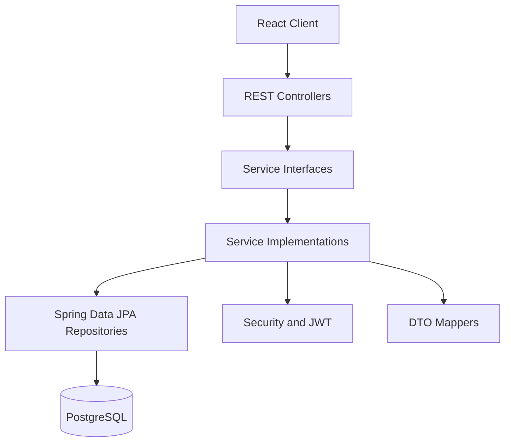
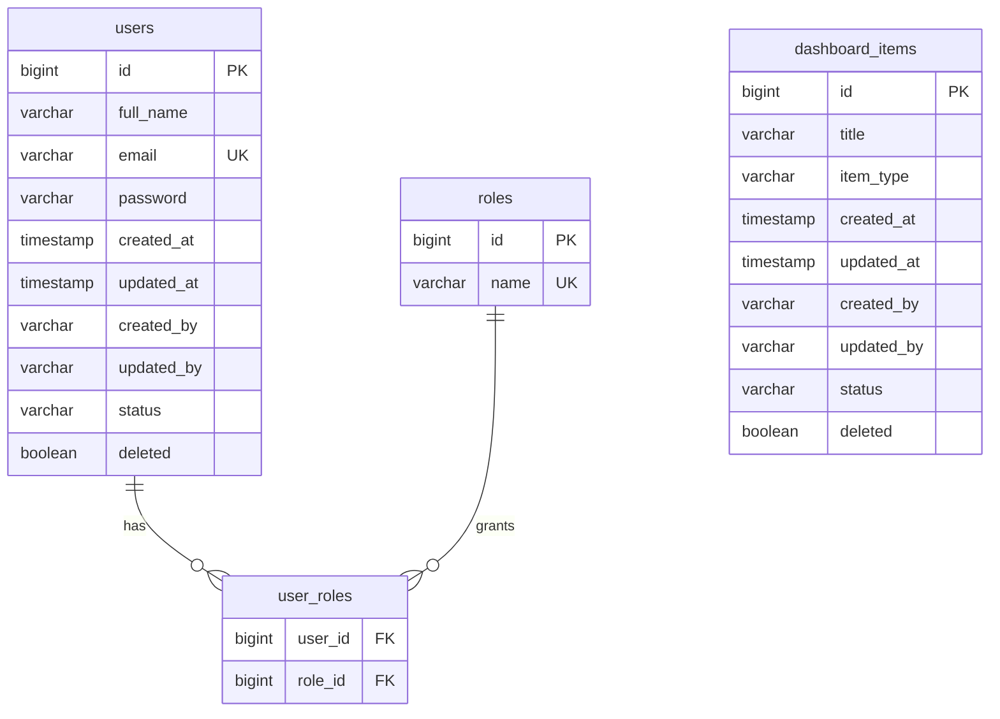

# CareerOS Backend Architecture

## Architecture

CareerOS follows a layered Spring Boot architecture:



Controllers only validate transport concerns and return standard responses. Business rules live in service implementations. Repositories are persistence-only.

## Package Structure

```text
com.careeros
  auth
    controller
    dto
    service
    service.impl
  common
    config
    dto
    entity
    enums
    exception
  dashboard
    controller
    dto
    entity
    repository
    service
    service.impl
  security
  user
    entity
    enums
    repository
```

Future modules should follow the same shape: `controller`, `dto`, `entity`, `repository`, `service`, and `service.impl`.

## Current Database Model



## Planned Core Entities

- `Plan`: tracks Plan A and Plan B goals.
- `Task`: stores actionable learning or placement tasks.
- `RoadmapItem`: stores learning roadmap milestones.
- `DsaProblem`: stores raw DSA solving activity.
- `BackendTopic`: stores Java/Spring/backend topic progress.
- `CoreSubject`: stores OS, DBMS, CN, OOP, and system design progress.
- `Interview`: stores interview experiences.
- `Note`: stores knowledge notes.
- `StudySession`: stores raw study time for analytics.
- `ActivityLog`: stores raw activity events for dashboard and analytics aggregation.

## API Foundation

Every API returns:

```json
{
  "success": true,
  "message": "Operation completed successfully",
  "data": {},
  "timestamp": "",
  "path": ""
}
```

Current APIs:

| Method | Endpoint | Purpose | Auth |
| --- | --- | --- | --- |
| `POST` | `/api/auth/register` | Register user and return JWT | Public |
| `POST` | `/api/auth/login` | Login user and return JWT | Public |
| `GET` | `/api/health` | Health check | Public |
| `GET` | `/api/dashboard` | Dashboard summary | Protected |

## Security

- Stateless Spring Security.
- BCrypt password hashing.
- JWT access token support.
- Role-ready users through `ROLE_USER` and `ROLE_ADMIN`.
- Refresh tokens are intentionally left as the next security extension.
- OAuth2 and Google login can be added without changing the user aggregate.

## Development Order

1. Finish authentication: refresh tokens, current user endpoint, logout strategy.
2. Add module CRUD APIs: notes, tasks, plans, DSA, backend topics, interviews.
3. Add pagination, sorting, filtering, and search DTOs.
4. Add activity logging for every user action.
5. Build dashboard aggregation from module services.
6. Build analytics from raw activity and study sessions.
7. Add integration tests with PostgreSQL Testcontainers.
8. Prepare Docker, Redis cache boundaries, and Kafka-ready event interfaces.
